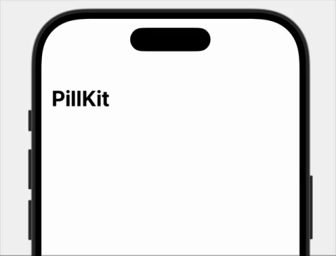

# PillKit

[](https://swift.org/package-manager/)


[](LICENSE)
[](https://github.com/ceviixx/PillKit/releases)


**PillKit** is a lightweight SwiftUI overlay banner inspired by native iOS system indicators – like the floating notification you see when **connecting AirPods**, **toggling the mute switch**, or **activating a Focus mode**.

Apple doesn’t provide any public API to recreate this behavior, so **PillKit** gives you an easy way to implement a similar experience with animation, drag-to-dismiss, and haptic feedback. Fully usable from anywhere – even outside SwiftUI views.

## Features

- ✅ Show banners from anywhere – even outside SwiftUI views
- ✅ Animated slide-in from top with fade
- ✅ Auto-dismiss after timeout
- ✅ Draggable: swipe up to dismiss interactively
- ✅ Optional haptic feedback for `.success`, `.failure`, or `.custom`
- ✅ Does not block UI or touch interaction
- ✅ Supports `.success`, `.failure`, `.default(...)` or `.custom(...)` content
- ✅ Content-size based width with optional max width
- ✅ Global API usable from view models, services, AppDelegate, etc.

---

## Preview

|✅ Success|❌ Failure|🔔 Custom|
|----------|----------|---------|
||||

---

## Installation

### Swift Package Manager

In Xcode:

- File → Add Packages...
- Use URL:

```text
https://github.com/ceviixx/PillKit.git
```

---

## Usage

### Show a success or failure banner

```swift
import PillKit

PillPresenter.show(.success(title: "Upload complete"))
PillPresenter.show(.failure(title: "Something went wrong"))
```

### Show with custom haptic

```swift
PillPresenter.show(.success(title: "Saved!", haptic: .light))
PillPresenter.show(.failure(title: "Error!", haptic: .none))
```

### Show a custom banner

```swift
PillPresenter.show(.custom(
    view: AnyView(
        VStack {
            Text("🔔 Notification")
                .font(.headline)
            Text("This is a custom view.")
        }
        .padding()
        .background(.thinMaterial)
        .cornerRadius(12)
    ),
    haptic: .soft
))
```

### Show a `.default` banner with custom color and icon

```swift
PillPresenter.show(.default(
    title: "New Feature",
    message: "Check out what's new!",
    systemImage: "sparkles",
    color: Color.blue.opacity(0.2),
    haptic: .light
))
```

### Show a `.default` banner without icon or message

```swift
PillPresenter.show(.default(
    title: "Something happened"
))
```

### Show a `.default` banner with dark background

```swift
PillPresenter.show(.default(
    title: "Heads up",
    message: "This is a dark alert",
    systemImage: "bolt.trianglebadge.exclamationmark",
    color: Color.black.opacity(0.85),
    haptic: .rigid
))
```

---

## Options

```swift
PillPresenter.show(
    .success(title: "Saved!"),
    autoHideEnabled: true,  // default: true
    duration: 3             // seconds
)
```

---

## Global Settings

```swift
PillPresenter.hapticsEnabled = false  // disables all haptics globally
```

---

## Behavior

- Appears at the top of the screen
- Automatically hides after `duration` unless `autoHideEnabled = false`
- Can be manually dismissed with `PillPresenter.hide()`
- Can be dragged upward by the user to dismiss interactively
- Works over sheets, fullScreenCover, and navigation stacks
- Does not block interaction with views underneath

---

## License

MIT License
